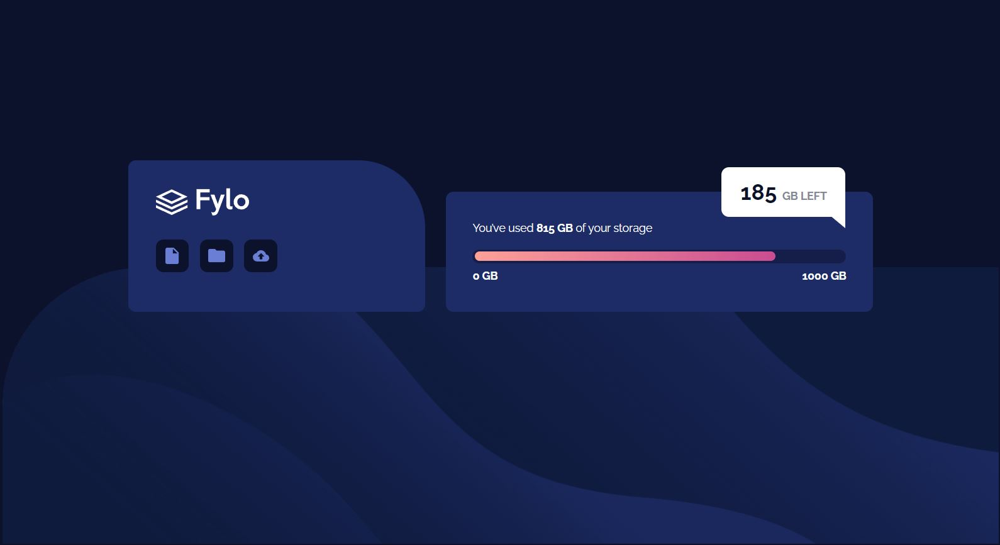

# Frontend Mentor - Fylo data storage component solution

This is a solution to the [Fylo data storage component challenge on Frontend Mentor](https://www.frontendmentor.io/challenges/fylo-data-storage-component-1dZPRbV5n). Frontend Mentor challenges help you improve your coding skills by building realistic projects. 

## Table of contents

- [Overview](#overview)
  - [The challenge](#the-challenge)
  - [Screenshot](#screenshot)
  - [Links](#links)
- [My process](#my-process)
  - [Built with](#built-with)
  - [What I learned](#what-i-learned)

## Overview

### The challenge

Users should be able to:

- View the optimal layout for the site depending on their device's screen size

### Screenshot

### Links

- Solution URL: [https://www.frontendmentor.io/challenges/fylo-data-storage-component-1dZPRbV5n/hub/fylo-data-indicator-challenge-SyE9QNXm9](https://www.frontendmentor.io/challenges/fylo-data-storage-component-1dZPRbV5n/hub/fylo-data-indicator-challenge-SyE9QNXm9)
- Live Site URL: [https://gregsgrog.github.io/fylo-data-storage-component-master/](https://gregsgrog.github.io/fylo-data-storage-component-master/)

## My process
I started by building planning out my project in figma. I then added my HTML tags, before linking my css file, adding the google font and adding my css.

### Built with

- Semantic HTML5 markup
- CSS custom properties
- Mobile-first workflow
- [Figma](https://www.figma.com/) - Design
- [Google Fonts](https://fonts.google.com/) - Fonts

### What I learned

I learned to position elements within a page to allow for more complex designs

